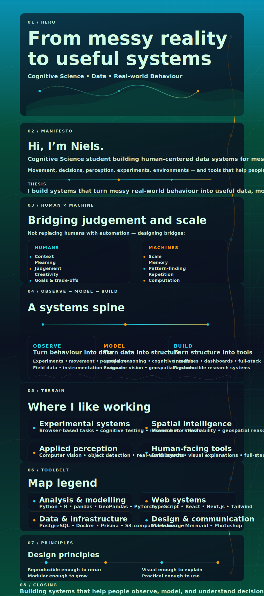

Text version

I’m Niels, a Cognitive Science student building human-centered data systems for messy real-world behaviour.

I’m interested in the moment where the real world becomes structured enough to reason about — not to replace humans with automation, but to build bridges where judgement, context, meaning, and creativity stay human, while machines handle scale, memory, repetition, pattern-finding, and computation.

I like working with experimental systems, spatial intelligence, applied perception, and human-facing tools.

Building systems that help people observe, model, and understand decisions in the wild.

