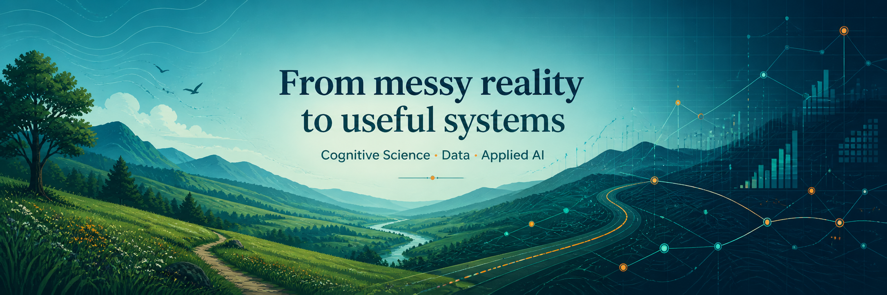
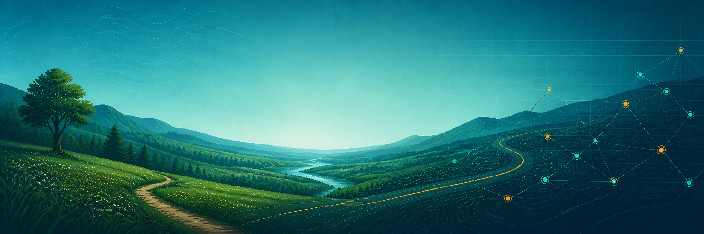

  

<h2 align="center">Hi, I’m Niels 👋</h2>

  Cognitive Science student building human-centered data systems for messy real-world behaviour.

  <strong>From messy reality to useful systems.</strong>

  

<table>
  <tr>
    <td>
        I’m finishing my bachelor’s in Cognitive Science and continuing into the master’s.
        I’m interested in the point where raw, messy reality becomes structured enough to reason about.
      

      

        That might mean tracking movement, designing experiments, modelling spatial possibilities, detecting objects,
        visualizing behaviour, or building interfaces that help people make better decisions.
      

      

        The guiding idea is simple: let humans do what humans are good at — context, meaning, and judgement — and let machines do what they’re good at — scale, memory, and computation.
      

  </tr>
</table>

 

<table>
  <tr>
    <td align="center" width="33%">
      <strong>Observe</strong> 
      Turn real-world behaviour into data
    </td>
    <td align="center" width="33%">
      <strong>Model</strong> 
      Build abstractions that explain possibilities
    </td>
    <td align="center" width="33%">
      <strong>Build</strong> 
      Create interfaces people can actually use
    </td>
  </tr>
</table>

 

## What I like building

<table>
  <tr>
    <td width="50%">
      <strong>Experimental systems</strong> 
      Browser-based tasks, cognitive testing tools, and interactive research workflows.
    </td>
    <td width="50%">
      <strong>Spatial intelligence</strong> 
      Movement models, reachability, tactical behaviour, and geospatial reasoning.
    </td>
  </tr>
  <tr>
    <td width="50%">
      <strong>Applied perception</strong> 
      Computer vision and practical detection for real-world constraints.
    </td>
    <td width="50%">
      <strong>Human-facing tools</strong> 
      Dashboards, visual explanations, and full-stack systems people can actually use.
    </td>
  </tr>
</table>

 

## Toolbelt

- **Analysis & modelling:** Python, R, pandas, GeoPandas, PyTorch
- **Web systems:** TypeScript, React, Next.js, Tailwind
- **Data & infrastructure:** PostgreSQL, Docker, Prisma
- **Design & communication:** Markdown, Mermaid, Photoshop

 

## How I work

- Reproducible enough to rerun later
- Visual enough to explain clearly
- Modular enough to grow
- Practical enough that someone could actually use it
- Documented enough that future-me can pick it up quickly

 

  

  <em>Building systems that help us observe, model, and understand decisions in the wild.</em>

